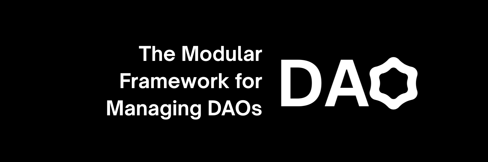

# The DAO Tool


A modern open-source platform to manage bounties, contributors, payments, and DAO workflows — all in one place.


## Project Links

| Resource       | Link                                                                                     |
|----------------|------------------------------------------------------------------------------------------|
| Website        | [https://www.thedaotool.com](https://www.thedaotool.com)                                 |
| DAO App        | [https://app.thedaotool.com](https://app.thedaotool.com)                                 |
| Docs           | [https://docs.thedaotool.com](https://docs.thedaotool.com)                               |
| GitHub         | [https://github.com/kartikmehta8/thedaotool](https://github.com/kartikmehta8/thedaotool) |
| X              | [https://x.com/thedaotool](https://x.com/thedaotool)                               |
| Discord        | [https://discord.gg/VsyDp52Saq](https://discord.gg/VsyDp52Saq)                               |

**Follow us on [X](https://x.com/thedaotool) for the latest updates, feature releases, and announcements.**

## Getting Started

```bash
# Check CONTRIBUTING.md or docs for detailed instructions.
git clone https://github.com/kartikmehta8/thedaotool
cd thedaotool

# Install dependencies in client/ and server/
npm install

# Start development server.
npm run dev

# Start development client.
npm start
```

- Frontend: http://localhost:3000  
- Backend API: http://localhost:5050  

## Tech Stack

- React + Ant Design (Frontend)
- Node.js + Express (Backend)
- Firebase (Database, Misc)
- Privy + Web3Auth (Wallets & Payouts)

## Privy Setup

1. Add `REACT_APP_PRIVY_APP_ID` to `client/.env` with your Privy application ID.
2. Add `PRIVY_RPC_URL` to `server/.env` pointing to your blockchain RPC endpoint.
3. Install dependencies with `npm install` in both `client/` and `server/`.
4. Start the backend with `npm run dev` and frontend with `npm start`.

## License

This project is licensed under the [MIT License](LICENSE).
